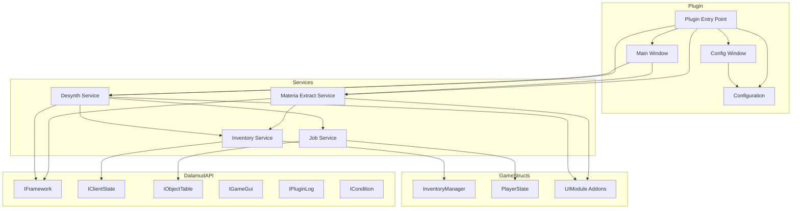
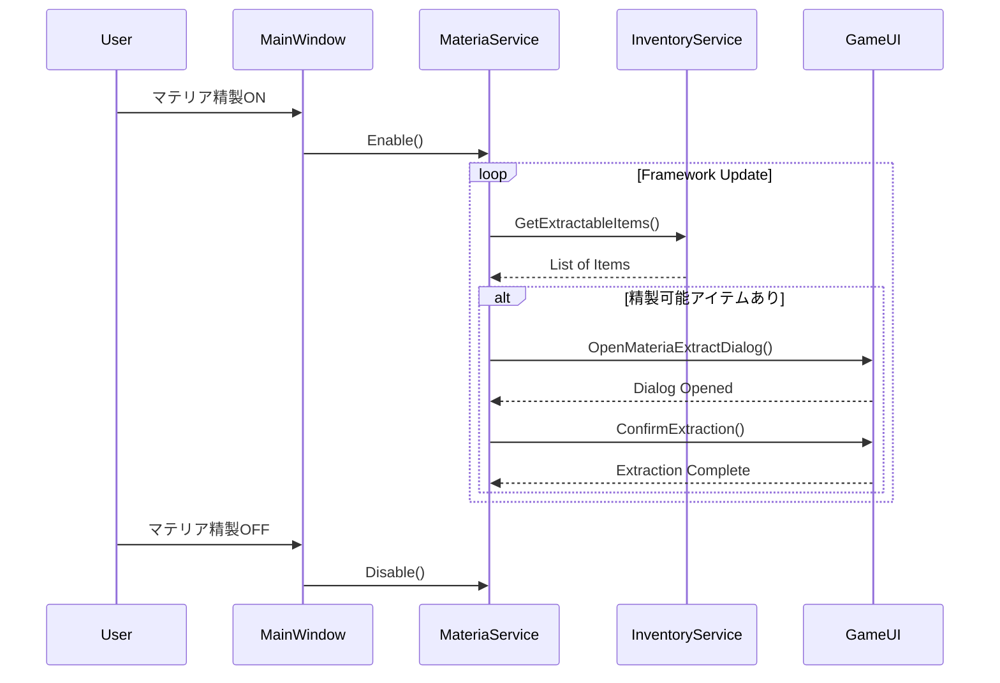
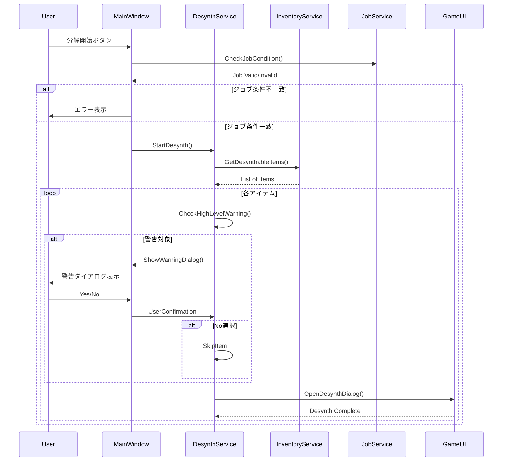
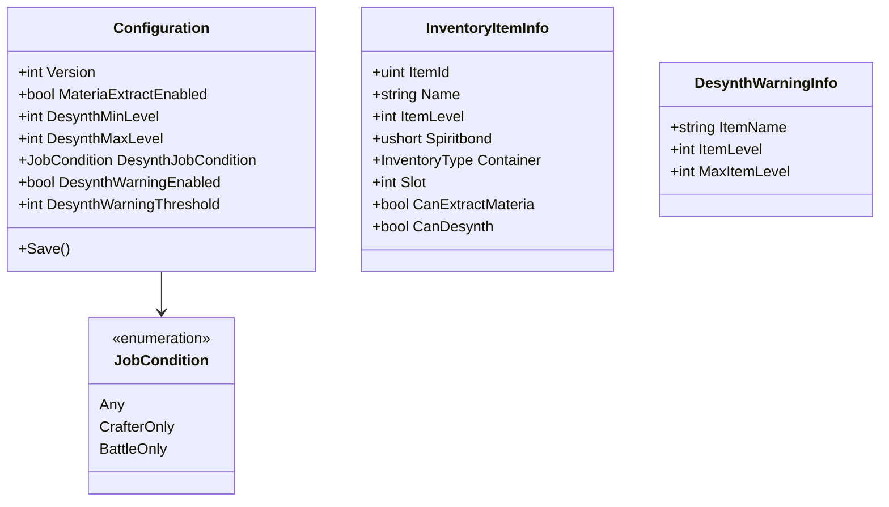

# Design Document

## Overview
**Purpose**: XIV Mini UtilはFinal Fantasy XIV (Dalamud)向けのユーティリティプラグインであり、マテリア精製とアイテム分解の自動化機能を提供する。

**Users**: FFXIVプレイヤーがゲーム内で所持品・アーマリーチェストの整理を効率化するために使用する。

**Impact**: 手動で行っていたマテリア精製とアイテム分解の作業を自動化し、プレイ体験を向上させる。

### Goals
- スピリットボンド100%アイテムの自動マテリア精製
- 条件指定によるアイテム分解の自動化
- 高レベルアイテムの誤分解防止
- ジョブ条件による分解実行制御

### Non-Goals
- ギアセット管理機能
- マテリア装着機能
- リテイナーのインベントリ操作
- 分解スキルレベルの自動上げ

## Architecture

### Architecture Pattern & Boundary Map



**Architecture Integration**:
- Selected pattern: Service-Based Architecture（機能ごとにサービスを分離）
- Domain boundaries: UI層（Windows）、サービス層（Services）、データアクセス層（Inventory/Job Services）
- Existing patterns preserved: Dalamud標準のDependency Injection
- New components rationale: 各機能を独立したサービスとして実装し、テスト容易性と保守性を確保
- Steering compliance: 該当なし（初期プロジェクト）

### Technology Stack

| Layer | Choice / Version | Role in Feature | Notes |
|-------|------------------|-----------------|-------|
| Runtime | .NET 10 | プラグイン実行環境 | Dalamud v14必須 |
| SDK | Dalamud.NET.Sdk 14.0.1 | ビルド・パッケージング | マニフェスト自動生成対応 |
| UI Framework | ImGui (Dalamud.Interface) | ゲーム内UI表示 | ImGuiNET経由 |
| Game Data | Lumina | Excelシートアクセス | アイテム情報取得 |
| Game Structs | FFXIVClientStructs | メモリ構造アクセス | インベントリ・UI操作 |
| DI Container | Dalamud Services | 依存性注入 | 標準サービス取得 |

## System Flows

### マテリア精製フロー



### アイテム分解フロー



## Requirements Traceability

| Requirement | Summary | Components | Interfaces | Flows |
|-------------|---------|------------|------------|-------|
| 1.1-1.5 | プラグイン基盤 | Plugin, Configuration | IDalamudPluginInterface | - |
| 2.1-2.4 | 設定管理 | Configuration | IPluginConfiguration | - |
| 3.1-3.6 | ユーザーインターフェース | MainWindow, ConfigWindow | IWindow | - |
| 4.1-4.3 | コマンドシステム | Plugin | ICommandManager | - |
| 5.1-5.6 | マテリア精製機能 | MateriaExtractService | IMateriaExtractService | マテリア精製フロー |
| 6.1-6.5 | アイテム分解機能 | DesynthService | IDesynthService | アイテム分解フロー |
| 7.1-7.5 | 分解安全機能 | DesynthService, MainWindow | IDesynthService | アイテム分解フロー |
| 8.1-8.6 | ジョブ条件 | JobService | IJobService | アイテム分解フロー |
| 9.1-9.7 | ゲームデータアクセス | InventoryService, JobService | IInventoryService, IJobService | - |
| 10.1-10.4 | ログ・通知 | 全サービス | IPluginLog | - |

## Components and Interfaces

| Component | Domain/Layer | Intent | Req Coverage | Key Dependencies | Contracts |
|-----------|--------------|--------|--------------|------------------|-----------|
| Plugin | Entry | プラグインエントリーポイント、DI設定 | 1.1-1.5, 4.1-4.3 | IDalamudPluginInterface (P0) | - |
| Configuration | Data | 設定データの永続化 | 2.1-2.4 | IPluginConfiguration (P0) | State |
| MainWindow | UI | メイン操作UI | 3.1-3.6 | ImGui (P0), Services (P1) | - |
| ConfigWindow | UI | 設定UI | 3.2 | ImGui (P0), Configuration (P0) | - |
| MateriaExtractService | Service | マテリア精製ロジック | 5.1-5.6, 10.2 | InventoryService (P0), IFramework (P0) | Service |
| DesynthService | Service | アイテム分解ロジック | 6.1-6.5, 7.1-7.5, 10.3 | InventoryService (P0), JobService (P0) | Service |
| InventoryService | Service | インベントリアクセス | 9.1-9.5 | InventoryManager (P0) | Service |
| JobService | Service | ジョブ情報取得 | 8.1-8.6, 9.6-9.7 | IObjectTable (P0), PlayerState (P0) | Service |

### Entry Layer

#### Plugin

| Field | Detail |
|-------|--------|
| Intent | プラグインのエントリーポイント、サービス初期化、コマンド登録 |
| Requirements | 1.1, 1.2, 1.3, 1.4, 1.5, 4.1, 4.2, 4.3 |

**Responsibilities & Constraints**
- Dalamud DIコンテナからサービスを取得
- プラグインコマンド（/xivminiutil）の登録・ハンドリング
- ウィンドウシステムへのUI登録
- Dispose時の全リソース解放

**Dependencies**
- Inbound: Dalamud Framework — プラグインロード (P0)
- Outbound: All Services — 機能提供 (P0)
- External: IDalamudPluginInterface — Dalamud API (P0)

**Contracts**: Service [x]

##### Service Interface
```csharp
public sealed class Plugin : IDalamudPlugin, IDisposable
{
    public string Name => "XIV Mini Util";

    public Plugin(
        IDalamudPluginInterface pluginInterface,
        ICommandManager commandManager,
        IFramework framework,
        IClientState clientState,
        IObjectTable objectTable,
        IGameGui gameGui,
        ICondition condition,
        IPluginLog pluginLog);

    public void Dispose();

    private void OnCommand(string command, string args);
}
```
- Preconditions: Dalamudがロード済み
- Postconditions: 全サービスとUIが利用可能
- Invariants: シングルインスタンス

### Data Layer

#### Configuration

| Field | Detail |
|-------|--------|
| Intent | プラグイン設定の永続化と管理 |
| Requirements | 2.1, 2.2, 2.3, 2.4 |

**Responsibilities & Constraints**
- JSON形式での設定シリアライズ
- デフォルト値の提供
- 設定変更時の自動保存

**Dependencies**
- Inbound: Plugin, ConfigWindow — 設定読み書き (P0)
- External: IPluginConfiguration — Dalamud設定API (P0)

**Contracts**: State [x]

##### State Management
```csharp
[Serializable]
public class Configuration : IPluginConfiguration
{
    public int Version { get; set; } = 1;

    // マテリア精製設定
    public bool MateriaExtractEnabled { get; set; } = false;

    // アイテム分解設定
    public int DesynthMinLevel { get; set; } = 1;
    public int DesynthMaxLevel { get; set; } = 999;
    public JobCondition DesynthJobCondition { get; set; } = JobCondition.Any;
    public bool DesynthWarningEnabled { get; set; } = true;
    public int DesynthWarningThreshold { get; set; } = 100;

    public void Save();
}

public enum JobCondition
{
    Any = 0,
    CrafterOnly = 1,
    BattleOnly = 2
}
```
- Persistence: Dalamud標準の設定ディレクトリに自動保存
- Consistency: 変更時に即座に保存
- Concurrency: シングルスレッドアクセス前提

### UI Layer

#### MainWindow

| Field | Detail |
|-------|--------|
| Intent | メイン操作インターフェース |
| Requirements | 3.1, 3.4, 3.5, 3.6 |

**Responsibilities & Constraints**
- マテリア精製のオン/オフボタン表示
- アイテム分解の開始ボタンと設定表示
- 警告ダイアログのモーダル表示
- ウィンドウ位置・サイズの記憶

**Dependencies**
- Inbound: Plugin — ウィンドウ登録 (P0)
- Outbound: MateriaExtractService, DesynthService — 機能呼び出し (P0)
- External: ImGui — UI描画 (P0)

**Contracts**: Service [x]

##### Service Interface
```csharp
public class MainWindow : Window, IDisposable
{
    public MainWindow(
        Configuration configuration,
        MateriaExtractService materiaService,
        DesynthService desynthService);

    public override void Draw();
    public void ShowWarningDialog(DesynthWarningInfo info);
    public void Dispose();
}

public record DesynthWarningInfo(
    string ItemName,
    int ItemLevel,
    int MaxItemLevel);
```

**Implementation Notes**
- Integration: ImGuiベースのウィンドウ、Dalamud.Interface.Windowを継承
- Validation: ボタン状態はサービス状態と同期
- Risks: UIスレッド以外からの呼び出し禁止

#### ConfigWindow

| Field | Detail |
|-------|--------|
| Intent | 詳細設定インターフェース |
| Requirements | 3.2 |

**Responsibilities & Constraints**
- 分解レベル範囲の入力
- ジョブ条件の選択
- 警告設定の変更

**Dependencies**
- Inbound: Plugin — ウィンドウ登録 (P0)
- Outbound: Configuration — 設定保存 (P0)
- External: ImGui — UI描画 (P0)

**Implementation Notes**
- Integration: MainWindowとは別ウィンドウとして実装
- Validation: 入力値の範囲チェック（レベル1-999）

### Service Layer

#### MateriaExtractService

| Field | Detail |
|-------|--------|
| Intent | マテリア精製の自動化ロジック |
| Requirements | 5.1, 5.2, 5.3, 5.4, 5.5, 5.6, 10.2 |

**Responsibilities & Constraints**
- スピリットボンド100%アイテムの検出
- ゲームUIを通じたマテリア精製実行
- 精製状態の管理（オン/オフ）

**Dependencies**
- Inbound: MainWindow — 有効/無効切り替え (P0)
- Outbound: InventoryService — アイテム情報取得 (P0)
- External: IFramework — フレーム更新イベント (P0)
- External: ICondition — 精製中状態チェック (P1)

**Contracts**: Service [x]

##### Service Interface
```csharp
public interface IMateriaExtractService : IDisposable
{
    bool IsEnabled { get; }
    bool IsProcessing { get; }

    void Enable();
    void Disable();
}

public class MateriaExtractService : IMateriaExtractService
{
    public MateriaExtractService(
        IFramework framework,
        ICondition condition,
        IPluginLog pluginLog,
        InventoryService inventoryService);

    public bool IsEnabled { get; private set; }
    public bool IsProcessing { get; private set; }

    public void Enable();
    public void Disable();
    public void Dispose();

    private void OnFrameworkUpdate(IFramework framework);
    private void ProcessNextItem();
}
```
- Preconditions: プレイヤーがログイン済み
- Postconditions: 精製可能アイテムが順次処理される
- Invariants: 同時に1アイテムのみ処理

#### DesynthService

| Field | Detail |
|-------|--------|
| Intent | アイテム分解の自動化ロジック |
| Requirements | 6.1, 6.2, 6.3, 6.4, 6.5, 7.1, 7.2, 7.3, 7.4, 7.5, 10.3 |

**Responsibilities & Constraints**
- 分解可能アイテムの検出とフィルタリング
- 高レベルアイテム警告の判定
- ゲームUIを通じた分解実行

**Dependencies**
- Inbound: MainWindow — 分解開始 (P0)
- Outbound: InventoryService — アイテム情報取得 (P0)
- Outbound: JobService — ジョブ条件チェック (P0)
- External: IFramework — フレーム更新イベント (P0)

**Contracts**: Service [x]

##### Service Interface
```csharp
public interface IDesynthService : IDisposable
{
    bool IsProcessing { get; }
    event Action<DesynthWarningInfo>? OnWarningRequired;

    Task<DesynthResult> StartDesynthAsync(DesynthOptions options);
    void ConfirmWarning(bool proceed);
    void Stop();
}

public class DesynthService : IDesynthService
{
    public DesynthService(
        IFramework framework,
        IPluginLog pluginLog,
        InventoryService inventoryService,
        JobService jobService,
        Configuration configuration);

    public bool IsProcessing { get; private set; }
    public event Action<DesynthWarningInfo>? OnWarningRequired;

    public Task<DesynthResult> StartDesynthAsync(DesynthOptions options);
    public void ConfirmWarning(bool proceed);
    public void Stop();
    public void Dispose();
}

public record DesynthOptions(
    int MinLevel,
    int MaxLevel,
    bool SkipHighLevelWarning);

public record DesynthResult(
    int ProcessedCount,
    int SkippedCount,
    List<string> Errors);
```
- Preconditions: プレイヤーがログイン済み、ジョブ条件を満たす
- Postconditions: 対象アイテムが分解される
- Invariants: 警告待ち状態では処理を一時停止

#### InventoryService

| Field | Detail |
|-------|--------|
| Intent | インベントリデータへのアクセス抽象化 |
| Requirements | 9.1, 9.2, 9.3, 9.4, 9.5 |

**Responsibilities & Constraints**
- 所持品・アーマリーチェストのスキャン
- アイテム情報（スピリットボンド、レベル、分解可否）の取得
- 最高アイテムレベルの算出

**Dependencies**
- Inbound: MateriaExtractService, DesynthService — データ取得 (P0)
- External: FFXIVClientStructs.InventoryManager — ゲームメモリ (P0)
- External: Lumina — Excelシート (P0)

**Contracts**: Service [x]

##### Service Interface
```csharp
public interface IInventoryService
{
    IEnumerable<InventoryItemInfo> GetExtractableItems();
    IEnumerable<InventoryItemInfo> GetDesynthableItems(int minLevel, int maxLevel);
    int GetMaxItemLevel();
    bool IsPlayerLoggedIn { get; }
}

public class InventoryService : IInventoryService
{
    public InventoryService(
        IClientState clientState,
        IDataManager dataManager);

    public IEnumerable<InventoryItemInfo> GetExtractableItems();
    public IEnumerable<InventoryItemInfo> GetDesynthableItems(int minLevel, int maxLevel);
    public int GetMaxItemLevel();
    public bool IsPlayerLoggedIn { get; }
}

public record InventoryItemInfo(
    uint ItemId,
    string Name,
    int ItemLevel,
    ushort Spiritbond,
    InventoryType Container,
    int Slot,
    bool CanExtractMateria,
    bool CanDesynth);
```
- Preconditions: ゲームクライアントが起動済み
- Postconditions: 最新のインベントリ状態を返す
- Invariants: データは読み取り専用

#### JobService

| Field | Detail |
|-------|--------|
| Intent | ジョブ情報の取得と条件判定 |
| Requirements | 8.1, 8.2, 8.3, 8.4, 8.5, 8.6, 9.6, 9.7 |

**Responsibilities & Constraints**
- 現在のプレイヤージョブ取得
- クラフター/戦闘職の判定
- ジョブ条件のチェック

**Dependencies**
- Inbound: DesynthService — ジョブチェック (P0)
- External: IObjectTable — LocalPlayer取得 (P0)
- External: Lumina.ClassJob — ジョブ情報 (P0)

**Contracts**: Service [x]

##### Service Interface
```csharp
public interface IJobService
{
    uint? CurrentClassJobId { get; }
    bool IsCrafter { get; }
    bool IsBattleJob { get; }
    bool CheckJobCondition(JobCondition condition);
}

public class JobService : IJobService
{
    // クラフタージョブID: CRP(8), BSM(9), ARM(10), GSM(11), LTW(12), WVR(13), ALC(14), CUL(15)
    private static readonly HashSet<uint> CrafterJobIds = new() { 8, 9, 10, 11, 12, 13, 14, 15 };

    public JobService(IObjectTable objectTable);

    public uint? CurrentClassJobId { get; }
    public bool IsCrafter => CurrentClassJobId.HasValue && CrafterJobIds.Contains(CurrentClassJobId.Value);
    public bool IsBattleJob => CurrentClassJobId.HasValue && !CrafterJobIds.Contains(CurrentClassJobId.Value);

    public bool CheckJobCondition(JobCondition condition);
}
```
- Preconditions: プレイヤーがログイン済み
- Postconditions: 現在のジョブ状態を返す
- Invariants: ジョブIDはリアルタイムで更新

## Data Models

### Domain Model



**Aggregates and Boundaries**:
- Configuration: 設定の集約ルート、プラグインライフサイクルで永続化
- InventoryItemInfo: インベントリアイテムの読み取り専用ビュー（値オブジェクト）
- DesynthWarningInfo: 警告ダイアログ用の一時データ（値オブジェクト）

**Business Rules**:
- スピリットボンド100% = Spiritbond値が10000
- 分解警告条件: アイテムレベル >= (最高アイテムレベル - WarningThreshold)
- ジョブ条件: CrafterOnly時はジョブID 8-15のみ許可

## Error Handling

### Error Strategy
- ゲームAPI呼び出しエラー: ログ出力後にスキップ、次アイテムへ継続
- UIアドオン未検出: 処理を停止、ユーザーに通知
- ログアウト検出: 自動的に機能を無効化

### Error Categories and Responses
**User Errors**: 無効なレベル範囲入力 → 入力フィールドで即時バリデーション
**System Errors**: ゲームUI操作失敗 → リトライ後にスキップ、ログ記録
**Business Logic Errors**: ジョブ条件不一致 → ボタン無効化とメッセージ表示

### Monitoring
- IPluginLogを使用したログ出力
- 精製/分解完了時のサマリーログ
- エラー発生時のスタックトレース記録

## Testing Strategy

### Unit Tests
- Configuration: シリアライズ/デシリアライズ、デフォルト値
- JobService: ジョブ条件判定ロジック
- InventoryService: フィルタリングロジック（モック使用）
- DesynthService: 警告条件判定

### Integration Tests
- MateriaExtractService: 有効/無効切り替えフロー
- DesynthService: 開始から完了までのフロー
- Configuration: 保存と読み込みの一貫性

### E2E/UI Tests
- MainWindow: ボタン操作とサービス連携
- ConfigWindow: 設定変更と保存
- 警告ダイアログ: 表示と応答処理

## Security Considerations
- ゲームメモリへの読み取りアクセスのみ（書き込みなし）
- UI操作はゲーム標準フローを使用
- 設定ファイルに機密情報を含まない

## Performance & Scalability
- フレーム更新時の処理を最小限に抑制
- インベントリスキャンはキャッシュを活用
- UIアドオン操作間に適切な遅延を挿入（ゲーム負荷軽減）
