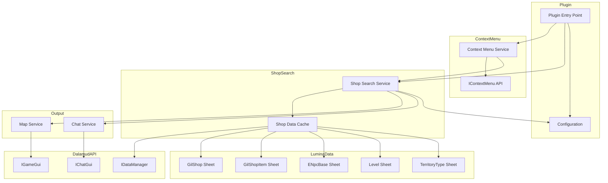
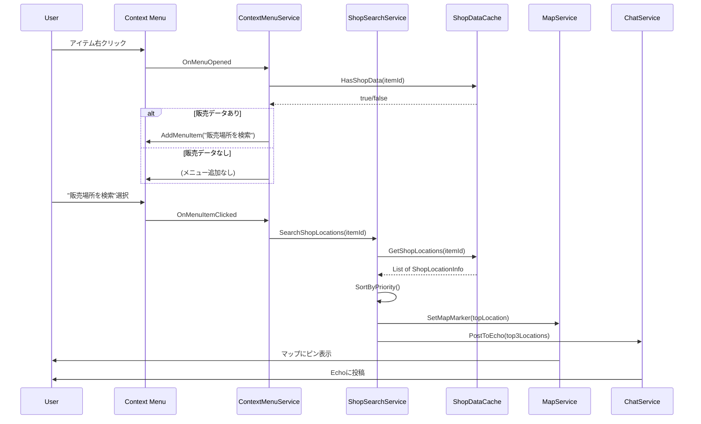
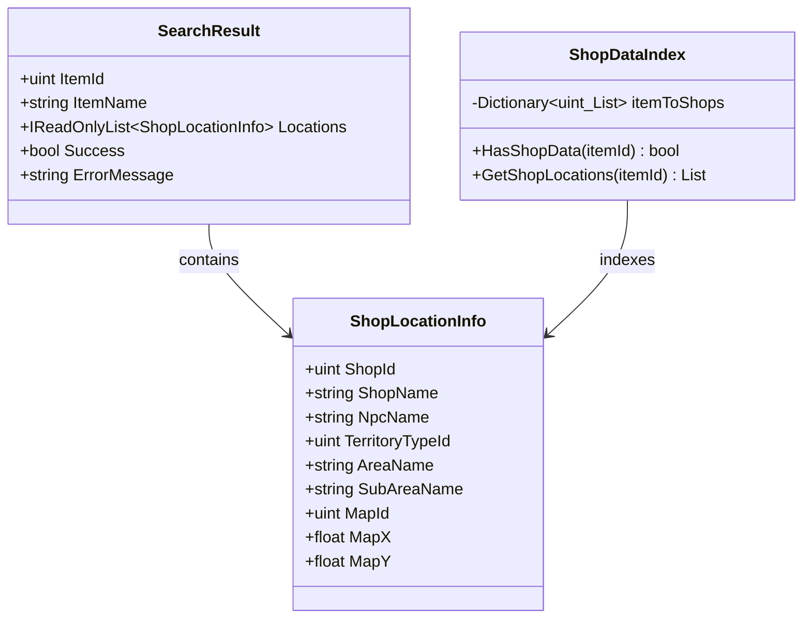

# Design Document

## Overview
**Purpose**: 本機能はアイテムの右クリックメニューに「販売場所を検索」オプションを追加し、ギルショップでの販売場所を検索・表示する。ユーザー設定の優先度に基づいて最適な販売場所を提案する。

**Users**: FFXIVプレイヤーがアイテム購入場所を素早く特定するために使用する。

**Impact**: 既存のプラグインにコンテキストメニュー統合とショップ検索サービスを追加する。

### Goals
- アイテム右クリックから販売場所を即座に検索可能にする
- 優先度に基づいて最適な販売場所を提案する
- マップピンとEcho投稿で移動をサポートする

### Non-Goals
- ギルショップ以外（軍票交換、スクリップ交換等）の対応
- 販売価格の比較機能
- 自動購入機能
- オフラインデータベースの提供

## Architecture

### Existing Architecture Analysis
現在のプラグインはService-Based Architectureを採用しており、以下のパターンを維持する：
- サービス層: InventoryService, JobService, DesynthService, MateriaExtractService
- UI層: MainWindow, ConfigWindow
- データ層: Configuration

本機能では以下を新規追加：
- ShopSearchService: ショップ検索ロジック
- ContextMenuService: コンテキストメニュー統合
- ShopDataCache: ショップデータのキャッシュ

### Architecture Pattern & Boundary Map



**Architecture Integration**:
- Selected pattern: Service-Based Architecture（既存パターン踏襲）
- Domain boundaries: コンテキストメニュー、ショップ検索、出力（マップ・チャット）
- Existing patterns preserved: DIコンテナ、サービス層分離
- New components rationale: 責務分離とテスト容易性のため各機能をサービス化
- Steering compliance: 該当なし

### Technology Stack

| Layer | Choice / Version | Role in Feature | Notes |
|-------|------------------|-----------------|-------|
| Runtime | .NET 10 | プラグイン実行環境 | 既存 |
| SDK | Dalamud.NET.Sdk 14.0.1 | ビルド・API | 既存 |
| Context Menu | IContextMenu | メニュー統合 | Dalamud標準API |
| Game Data | Lumina.Excel | Excelシートアクセス | 既存 |
| Map | IGameGui, MapLinkPayload | マップピン設定 | Dalamud標準API |
| Chat | IChatGui, SeString | Echo投稿 | Dalamud標準API |

## System Flows

### 販売場所検索フロー



## Requirements Traceability

| Requirement | Summary | Components | Interfaces | Flows |
|-------------|---------|------------|------------|-------|
| 1.1, 1.2, 1.3, 1.4 | コンテキストメニュー統合 | ContextMenuService | IContextMenu | 販売場所検索フロー |
| 1.5 | 非販売アイテム除外 | ContextMenuService, ShopDataCache | - | - |
| 2.1, 2.2, 2.3 | 販売場所検索 | ShopSearchService, ShopDataCache | IShopSearchService | 販売場所検索フロー |
| 2.4 | 検索失敗通知 | ShopSearchService, ChatService | IChatGui | - |
| 2.5 | マーケット取引不可除外 | ShopDataCache | - | - |
| 3.1, 3.2, 3.3 | Echo投稿 | ChatService | IChatGui | 販売場所検索フロー |
| 3.4, 3.5 | 結果リストUI | ShopSearchResultWindow | - | - |
| 4.1, 4.2, 4.3 | マップ連携 | MapService | IGameGui | 販売場所検索フロー |
| 5.1-5.5 | 優先度設定 | Configuration, ConfigWindow | - | - |
| 6.1-6.4 | データソース管理 | ShopDataCache | IDataManager | - |
| 7.1-7.3 | パフォーマンス | ShopDataCache | - | - |

## Components and Interfaces

| Component | Domain/Layer | Intent | Req Coverage | Key Dependencies | Contracts |
|-----------|--------------|--------|--------------|------------------|-----------|
| ContextMenuService | Integration | アイテムコンテキストメニューへの統合 | 1.1-1.5 | IContextMenu (P0), ShopSearchService (P0) | Service |
| ShopSearchService | Service | 販売場所検索のオーケストレーション | 2.1-2.5, 3.1-3.3, 4.1 | ShopDataCache (P0), MapService (P0), ChatService (P0) | Service |
| ShopDataCache | Data | ショップデータのキャッシュと逆引きインデックス | 6.1-6.4, 7.1-7.3 | IDataManager (P0) | Service |
| MapService | Output | マップピン設定とマップリンク生成 | 4.1-4.3 | IGameGui (P0) | Service |
| ChatService | Output | Echo投稿とSeString生成 | 3.1-3.3 | IChatGui (P0) | Service |
| ShopSearchResultWindow | UI | 検索結果の詳細表示 | 3.4, 3.5 | ImGui (P0), ShopSearchService (P1) | - |
| Configuration (拡張) | Data | 優先度設定の永続化 | 5.1-5.5 | IPluginConfiguration (P0) | State |

### Integration Layer

#### ContextMenuService

| Field | Detail |
|-------|--------|
| Intent | IContextMenu APIを通じてアイテム右クリックメニューに「販売場所を検索」を追加 |
| Requirements | 1.1, 1.2, 1.3, 1.4, 1.5 |

**Responsibilities & Constraints**
- IContextMenu.OnMenuOpenedイベントの購読
- インベントリアイテムコンテキストのフィルタリング
- ショップ販売データ有無による動的メニュー追加
- メニュー項目クリック時の検索実行

**Dependencies**
- Inbound: Plugin — 初期化 (P0)
- Outbound: ShopSearchService — 検索実行 (P0)
- Outbound: ShopDataCache — 販売データ有無確認 (P0)
- External: IContextMenu — Dalamud Context Menu API (P0)

**Contracts**: Service [x]

##### Service Interface
```csharp
public sealed class ContextMenuService : IDisposable
{
    public ContextMenuService(
        IContextMenu contextMenu,
        ShopSearchService shopSearchService,
        ShopDataCache shopDataCache,
        IPluginLog pluginLog);

    public void Dispose();

    private void OnMenuOpened(IMenuOpenedArgs args);
    private void OnSearchClicked(IMenuItemClickedArgs args);
}
```
- Preconditions: ShopDataCacheが初期化済み
- Postconditions: コンテキストメニューにカスタム項目が追加される
- Invariants: Disposeまでイベント購読を維持

**Implementation Notes**
- Integration: `MenuTargetInventory` でインベントリアイテムを識別
- Validation: アイテムIDが有効かつショップ販売データが存在する場合のみメニュー追加
- Risks: ゲームパッチでコンテキストメニュー構造が変更される可能性

### Service Layer

#### ShopSearchService

| Field | Detail |
|-------|--------|
| Intent | 販売場所検索のオーケストレーションと結果の出力 |
| Requirements | 2.1, 2.2, 2.3, 2.4, 2.5, 3.1, 3.2, 3.3, 4.1 |

**Responsibilities & Constraints**
- ShopDataCacheからの販売場所取得
- Configuration優先度に基づくソート
- MapService経由でマップピン設定
- ChatService経由でEcho投稿
- 検索失敗時のユーザー通知

**Dependencies**
- Inbound: ContextMenuService — 検索実行 (P0)
- Outbound: ShopDataCache — データ取得 (P0)
- Outbound: MapService — マップピン (P0)
- Outbound: ChatService — Echo投稿 (P0)
- Outbound: Configuration — 優先度設定 (P0)

**Contracts**: Service [x]

##### Service Interface
```csharp
public interface IShopSearchService
{
    SearchResult Search(uint itemId);
}

public sealed class ShopSearchService : IShopSearchService
{
    public ShopSearchService(
        ShopDataCache shopDataCache,
        MapService mapService,
        ChatService chatService,
        Configuration configuration,
        IPluginLog pluginLog);

    public SearchResult Search(uint itemId);
}

public sealed record SearchResult(
    uint ItemId,
    string ItemName,
    IReadOnlyList<ShopLocationInfo> Locations,
    bool Success,
    string? ErrorMessage);

public sealed record ShopLocationInfo(
    uint ShopId,
    string ShopName,
    string NpcName,
    uint TerritoryTypeId,
    string AreaName,
    string SubAreaName,
    uint MapId,
    float MapX,
    float MapY);
```
- Preconditions: itemIdが有効なアイテムID
- Postconditions: 検索結果を返し、成功時はマップとEchoに出力
- Invariants: 優先度設定に従ってソートされた結果を返す

**Implementation Notes**
- Integration: 検索完了後に自動でMapServiceとChatServiceを呼び出す
- Validation: アイテムIDの存在確認、マーケット取引不可属性のチェック

#### ShopDataCache

| Field | Detail |
|-------|--------|
| Intent | Luminaからショップデータを取得し逆引きインデックスを構築・キャッシュ |
| Requirements | 6.1, 6.2, 6.3, 6.4, 7.1, 7.2, 7.3 |

**Responsibilities & Constraints**
- 起動時にGilShop→GilShopItem→ENpcBase→Levelの逆引きインデックス構築
- ItemId → List<ShopLocationInfo> のO(1)ルックアップ提供
- ゲームセッション中はキャッシュを保持

**Dependencies**
- Inbound: ShopSearchService, ContextMenuService — データ取得 (P0)
- External: IDataManager — Luminaアクセス (P0)

**Contracts**: Service [x]

##### Service Interface
```csharp
public sealed class ShopDataCache
{
    public ShopDataCache(IDataManager dataManager, IPluginLog pluginLog);

    public bool IsInitialized { get; }
    public Task InitializeAsync();
    public bool HasShopData(uint itemId);
    public IReadOnlyList<ShopLocationInfo> GetShopLocations(uint itemId);
    public string GetItemName(uint itemId);
}
```
- Preconditions: IDataManagerが利用可能
- Postconditions: 全ギルショップアイテムの逆引きインデックスが構築される
- Invariants: 一度構築されたキャッシュは変更されない（読み取り専用）

**Implementation Notes**
- Integration: 非同期初期化でプラグイン起動をブロックしない
- Validation: Levelデータが欠落しているショップはスキップしログ出力
- Risks: 大量データのメモリ使用量（推定: 数MB程度）

### Output Layer

#### MapService

| Field | Detail |
|-------|--------|
| Intent | マップピン設定とマップリンクPayload生成 |
| Requirements | 4.1, 4.2, 4.3 |

**Responsibilities & Constraints**
- MapLinkPayload生成（TerritoryType、MapId、座標）
- IGameGui.OpenMapWithMapLinkでマップ表示とピン設定
- 座標変換（Level座標 → マップ座標）

**Dependencies**
- Inbound: ShopSearchService — マップピン設定 (P0)
- External: IGameGui — マップ操作 (P0)

**Contracts**: Service [x]

##### Service Interface
```csharp
public sealed class MapService
{
    public MapService(IGameGui gameGui, IDataManager dataManager, IPluginLog pluginLog);

    public void SetMapMarker(ShopLocationInfo location);
    public MapLinkPayload CreateMapLink(ShopLocationInfo location);
}
```
- Preconditions: 有効なShopLocationInfo（座標情報を含む）
- Postconditions: マップが開かれ、指定座標にフラグが設定される

**Implementation Notes**
- Integration: Level座標からマップ座標への変換計算が必要
- Validation: TerritoryTypeIdとMapIdの整合性確認

#### ChatService

| Field | Detail |
|-------|--------|
| Intent | Echo投稿とSeString生成（クリック可能なマップリンク付き） |
| Requirements | 3.1, 3.2, 3.3 |

**Responsibilities & Constraints**
- SeStringBuilderでマップリンク付きメッセージ生成
- IChatGui.PrintでEcho投稿
- 上位3件の販売場所をフォーマット出力

**Dependencies**
- Inbound: ShopSearchService — Echo投稿 (P0)
- Outbound: MapService — MapLinkPayload生成 (P1)
- External: IChatGui — チャット出力 (P0)

**Contracts**: Service [x]

##### Service Interface
```csharp
public sealed class ChatService
{
    public ChatService(IChatGui chatGui, MapService mapService, IPluginLog pluginLog);

    public void PostSearchResult(string itemName, IReadOnlyList<ShopLocationInfo> locations, int maxCount = 3);
    public void PostError(string message);
}
```
- Preconditions: IChatGuiが利用可能
- Postconditions: Echoにメッセージが投稿される

**Implementation Notes**
- Integration: SeString.Builder でマップリンクを埋め込み
- Example Output:
  ```
  [販売場所検索] ハイポーション
  1. リムサ・ロミンサ：下甲板層 (X:9.9, Y:11.4) <flag>
  2. ウルダハ：ナル回廊 (X:9.4, Y:8.5) <flag>
  ```

### UI Layer

#### ShopSearchResultWindow

| Field | Detail |
|-------|--------|
| Intent | 検索結果の詳細リスト表示（オプショナルUI） |
| Requirements | 3.4, 3.5 |

**Implementation Notes**
- Integration: ImGuiベースのウィンドウ、検索結果が4件以上ある場合に表示
- Validation: 選択された場所でMapServiceを呼び出しピンを更新
- Summary-only: 基本機能はEcho投稿で完結、UIは補助的

### Data Layer

#### Configuration (拡張)

| Field | Detail |
|-------|--------|
| Intent | 優先度設定の永続化 |
| Requirements | 5.1, 5.2, 5.3, 5.4, 5.5 |

**Contracts**: State [x]

##### State Management
```csharp
// 既存Configurationクラスに追加
public class Configuration : IPluginConfiguration
{
    // ... 既存プロパティ ...

    // 販売場所検索設定
    public List<uint> ShopSearchAreaPriority { get; set; } = new()
    {
        // デフォルト: 三大都市優先
        128,  // リムサ・ロミンサ：下甲板層
        129,  // リムサ・ロミンサ：上甲板層
        130,  // ウルダハ：ナル回廊
        131,  // ウルダハ：ザル回廊
        132,  // グリダニア：新市街
        133,  // グリダニア：旧市街
    };
}
```
- Persistence: Dalamud標準の設定ディレクトリに自動保存
- Consistency: 変更時に即座に保存

## Data Models

### Domain Model



**Aggregates and Boundaries**:
- ShopDataIndex: 読み取り専用の逆引きインデックス（起動時に構築）
- SearchResult: 検索結果の値オブジェクト
- ShopLocationInfo: 販売場所情報の値オブジェクト

**Business Rules**:
- 優先度リストに含まれるTerritoryTypeIdは先頭にソート
- 優先度リストに含まれないエリアはアルファベット順で末尾

### Logical Data Model

**Lumina Excel シート関係**:
```
Item (ItemId, Name, ItemSearchCategory, IsUntradable)
  ↓ (ItemId)
GilShopItem (RowId, Item, GilShop行番号)
  ↓ (行番号)
GilShop (RowId, Name, ENpcResident参照)
  ↓ (ENpcBase.Data[]内の参照)
ENpcBase (RowId, Data[32])
  ↓ (ENpcBase → Level)
Level (RowId, X, Y, Z, Territory, Map)
  ↓
TerritoryType (RowId, PlaceName) / Map (RowId, SizeFactor, OffsetX, OffsetY)
```

**逆引きインデックス構造**:
```csharp
Dictionary<uint, List<ShopLocationInfo>> ItemIdToShopLocations
```

## Error Handling

### Error Strategy
- ショップデータ取得失敗: ログ出力、該当エントリをスキップ
- 検索結果なし: ユーザーに通知メッセージをEcho投稿
- マップ操作失敗: ログ出力、Echo投稿は継続

### Error Categories and Responses
**User Errors**: 販売データなしアイテムの検索 → 「NPCショップでは販売されていません」通知
**System Errors**: Luminaデータアクセス失敗 → ログ出力、機能を無効化しない
**Business Logic Errors**: 座標変換失敗 → 該当ショップをスキップ、ログ警告

### Monitoring
- IPluginLogを使用したログ出力
- キャッシュ構築完了時のサマリーログ（登録アイテム数、ショップ数）
- 検索実行時のデバッグログ

## Testing Strategy

### Unit Tests
- ShopDataCache: インデックス構築、ルックアップ正確性
- ShopSearchService: 優先度ソートロジック
- MapService: 座標変換計算
- ChatService: SeStringフォーマット

### Integration Tests
- ContextMenuService: メニュー追加フロー
- ShopSearchService: 検索→出力の一連フロー
- Configuration: 優先度設定の保存と読み込み

### E2E/UI Tests
- コンテキストメニュー表示
- Echo投稿の内容確認
- マップピン設定の動作確認

## Performance & Scalability

### Target Metrics
- 検索応答時間: 500ms以内（7.1）
- キャッシュ構築時間: 5秒以内（推定）
- メモリ使用量: 10MB以下（推定）

### Optimization Techniques
- 起動時の非同期キャッシュ構築（7.2）
- Dictionary による O(1) ルックアップ（7.3）
- 遅延初期化オプション（初回検索時に構築）
